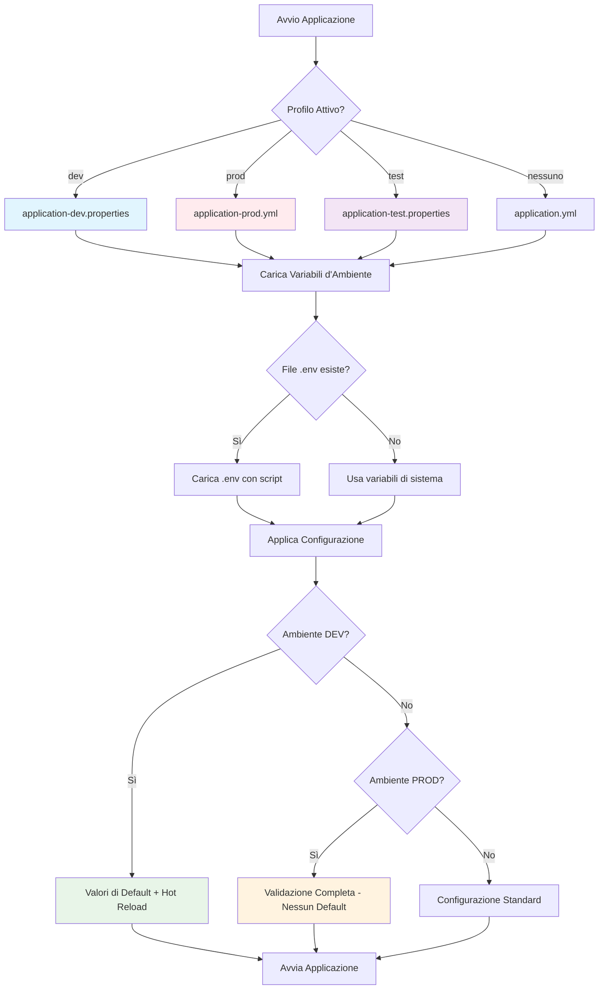

# Gestione dei Segreti - TaskManager

## Configurazione delle Variabili d'Ambiente

### 1. Creare un file `.env` nella root del progetto

**Copia il file di esempio:**
```bash
cp env.example .env
```

**Oppure crea manualmente un file `.env`** nella directory principale del progetto. Vedi il file `env.example` per tutti i parametri disponibili.

**Configurazione minima per iniziare:**
```bash
# Database Configuration
DB_HOST=localhost
DB_PORT=5432
DB_NAME=taskdb
DB_USERNAME=taskuser
DB_PASSWORD=your-secure-password-here

# Server Configuration
SERVER_PORT=8080

# Spring Profile
SPRING_PROFILES_ACTIVE=dev
```

### 2. Metodi per caricare le variabili d'ambiente

#### Opzione A: Usare lo script fornito
```bash
source load-env.sh
./mvnw spring-boot:run
```

#### Opzione B: Caricare manualmente
```bash
export DB_HOST=localhost
export DB_PORT=5432
export DB_NAME=taskdb
export DB_USERNAME=taskuser
export DB_PASSWORD=your-secure-password
export SERVER_PORT=8080
./mvnw spring-boot:run
```

#### Opzione C: Usare Docker Compose
```bash
# Le variabili d'ambiente vengono caricate automaticamente da .env
docker-compose up
```

### 3. Come funzionano i Profili Spring Boot

#### 🔧 **AMBIENTE DI SVILUPPO (dev)**

**File di configurazione:** `application-dev.properties`

**Caratteristiche:**
- ✅ **Valori di default sicuri** - Se non specifichi una variabile d'ambiente, usa valori predefiniti
- ✅ **Hot reload** - Rileva automaticamente i cambiamenti nel codice
- ✅ **Logging dettagliato** - Mostra query SQL e debug info
- ✅ **Database H2 in memoria** - Per test rapidi (opzionale)
- ✅ **CORS abilitato** - Per frontend su porte diverse

**Esempio di configurazione:**
```bash
# Nel tuo .env per sviluppo
DB_HOST=localhost
DB_PASSWORD=dev-password
SPRING_PROFILES_ACTIVE=dev
```

**Cosa succede:**
- Se `DB_HOST` non è definito → usa `localhost`
- Se `DB_PASSWORD` non è definito → usa `taskpass` (valore di default)
- Se `SERVER_PORT` non è definito → usa `8080`

#### 🚀 **AMBIENTE DI PRODUZIONE (prod)**

**File di configurazione:** `application-prod.yml`

**Caratteristiche:**
- ⚠️ **Nessun valore di default** - Tutte le variabili d'ambiente DEVONO essere specificate
- ⚠️ **Sicurezza massima** - Logging ridotto, nessun debug
- ⚠️ **Database PostgreSQL** - Solo database di produzione
- ⚠️ **Validazione schema** - Non crea/modifica tabelle automaticamente

**Esempio di configurazione:**
```bash
# Nel tuo .env per produzione
DB_HOST=prod-database-server.com
DB_PORT=5432
DB_NAME=taskmanager_prod
DB_USERNAME=prod_user
DB_PASSWORD=super-secure-production-password
SPRING_PROFILES_ACTIVE=prod
```

**Cosa succede:**
- Se `DB_PASSWORD` non è definito → **ERRORE** (l'app non si avvia)
- Se `DB_HOST` non è definito → **ERRORE** (l'app non si avvia)
- Tutte le variabili sono obbligatorie per la sicurezza

#### 📋 **CONFIGURAZIONE DEFAULT**

**File di configurazione:** `application.yml`

**Caratteristiche:**
- 🔄 **Configurazione base** - Valori di default per tutti gli ambienti
- 🔄 **Valori di fallback** - Se un profilo non specifica qualcosa, usa questi valori
- 🔄 **Configurazione comune** - Logging, JPA, Flyway, etc.

### 4. Mappatura dei File di Configurazione

```
📁 src/main/resources/
├── application.yml              # Configurazione base (sempre caricata)
├── application-dev.properties   # Profilo DEV (valori di default)
├── application-prod.yml         # Profilo PROD (nessun default)
└── application-test.properties  # Profilo TEST (per unit test)
```

### 5. Priorità di Caricamento

1. **Variabili d'ambiente** (massima priorità)
2. **File .env** (se caricato con script)
3. **application-{profile}.properties/yml**
4. **application.yml** (priorità minima)

### 6. Diagramma del Sistema di Configurazione



### 7. Sicurezza

- **NON** committare mai il file `.env` nel repository
- Il file `.env` è già incluso nel `.gitignore`
- Usa password complesse per la produzione
- Considera l'uso di servizi di gestione segreti (AWS Secrets Manager, Azure Key Vault, etc.) per la produzione

### 8. Esempi di utilizzo

#### Sviluppo locale
```bash
# 1. Crea il file .env con le tue configurazioni
# 2. Carica le variabili d'ambiente
source load-env.sh
# 3. Avvia l'applicazione
./mvnw spring-boot:run -Dspring-boot.run.profiles=dev
```

#### Produzione
```bash
# 1. Imposta le variabili d'ambiente nel sistema
export DB_HOST=your-prod-db-host
export DB_PASSWORD=your-secure-prod-password
# 2. Avvia con profilo di produzione
./mvnw spring-boot:run -Dspring-boot.run.profiles=prod
```

#### Docker
```bash
# Le variabili d'ambiente vengono caricate automaticamente da .env
docker-compose up
```

### 9. Esempi Pratici di Utilizzo

#### 🛠️ **SVILUPPO LOCALE**

**Passo 1:** Crea il file `.env`
```bash
cp env.example .env
# Modifica .env con le tue configurazioni
```

**Passo 2:** Avvia l'applicazione
```bash
# Opzione A: Con script (raccomandato)
source load-env.sh
./mvnw spring-boot:run

# Opzione B: Con profilo esplicito
./mvnw spring-boot:run -Dspring-boot.run.profiles=dev

# Opzione C: Con Docker
docker-compose up
```

**Cosa vedi nei log:**
```
INFO  - Starting TaskManagerApplication
DEBUG - Database URL: jdbc:postgresql://localhost:5432/taskdb
DEBUG - Using profile: dev
DEBUG - DevTools restart enabled
```

#### 🚀 **PRODUZIONE**

**Passo 1:** Configura le variabili d'ambiente nel server
```bash
# Nel server di produzione
export DB_HOST=prod-db-server.company.com
export DB_PORT=5432
export DB_NAME=taskmanager_production
export DB_USERNAME=taskmanager_user
export DB_PASSWORD=super-secure-password-123!
export SPRING_PROFILES_ACTIVE=prod
export SERVER_PORT=8080
```

**Passo 2:** Avvia l'applicazione
```bash
./mvnw spring-boot:run -Dspring-boot.run.profiles=prod
```

**Cosa vedi nei log:**
```
INFO  - Starting TaskManagerApplication
INFO  - Using profile: prod
INFO  - Database URL: jdbc:postgresql://prod-db-server.company.com:5432/taskmanager_production
WARN  - No default values for production environment
```

#### 🐳 **DOCKER (Raccomandato per tutti gli ambienti)**

**Per sviluppo:**
```bash
# Crea .env con configurazioni di sviluppo
cp env.example .env
# Modifica .env
docker-compose up
```

**Per produzione:**
```bash
# Crea .env con configurazioni di produzione
cp env.example .env
# Modifica .env con valori di produzione
# Modifica docker-compose.yml per usare profilo prod
docker-compose up
```

### 10. Esempi di Configurazione per Diversi Scenari

#### 📝 **Scenario 1: Sviluppo con Database Locale**
```bash
# .env
DB_HOST=localhost
DB_PORT=5432
DB_NAME=taskdb_dev
DB_USERNAME=dev_user
DB_PASSWORD=dev_password
SPRING_PROFILES_ACTIVE=dev
```

#### 📝 **Scenario 2: Sviluppo con Database Remoto**
```bash
# .env
DB_HOST=dev-db.company.com
DB_PORT=5432
DB_NAME=taskdb_dev
DB_USERNAME=dev_user
DB_PASSWORD=dev_password
SPRING_PROFILES_ACTIVE=dev
```

#### 📝 **Scenario 3: Produzione con Database Cloud**
```bash
# .env
DB_HOST=prod-db.aws.amazon.com
DB_PORT=5432
DB_NAME=taskmanager_prod
DB_USERNAME=prod_user
DB_PASSWORD=super-secure-production-password-2024!
SPRING_PROFILES_ACTIVE=prod
SERVER_PORT=8080
```

#### 📝 **Scenario 4: Test con Database H2**
```bash
# .env
DB_HOST=localhost
DB_NAME=testdb
SPRING_PROFILES_ACTIVE=test
# Per i test, Spring Boot userà H2 in memoria automaticamente
```

### 11. Verifica della configurazione

Per verificare che le variabili d'ambiente siano caricate correttamente, puoi aggiungere un endpoint di debug:

```java
@RestController
public class ConfigController {
    
    @Value("${spring.datasource.url}")
    private String dbUrl;
    
    @Value("${spring.datasource.username}")
    private String dbUsername;
    
    @GetMapping("/config")
    public Map<String, String> getConfig() {
        Map<String, String> config = new HashMap<>();
        config.put("dbUrl", dbUrl);
        config.put("dbUsername", dbUsername);
        // NON esporre mai le password in endpoint pubblici!
        return config;
    }
}
```
